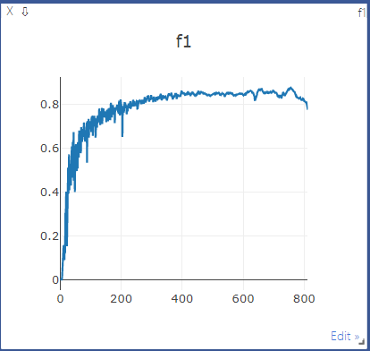
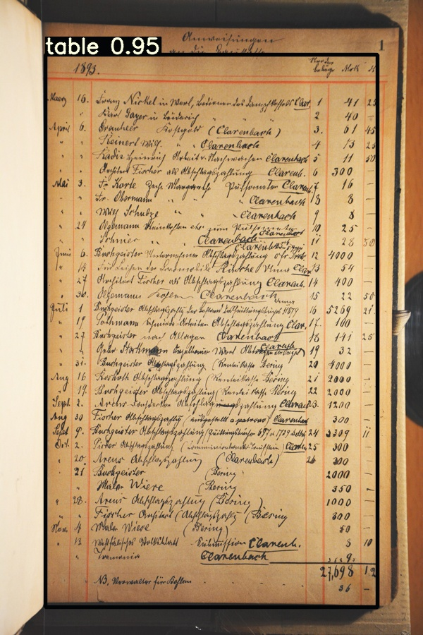
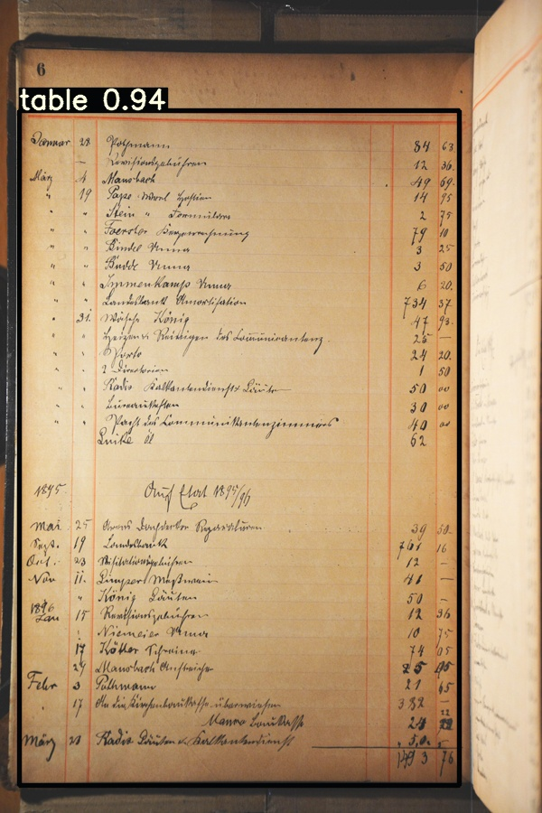
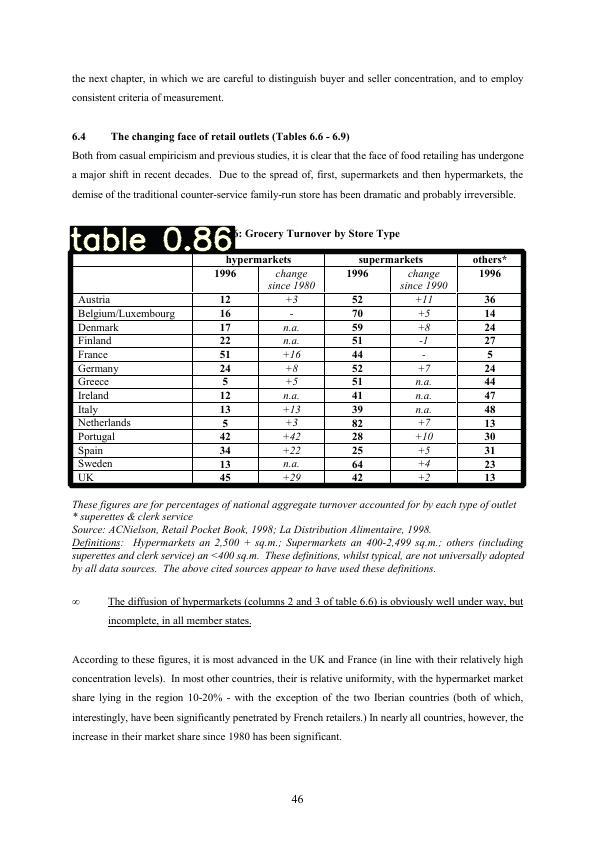
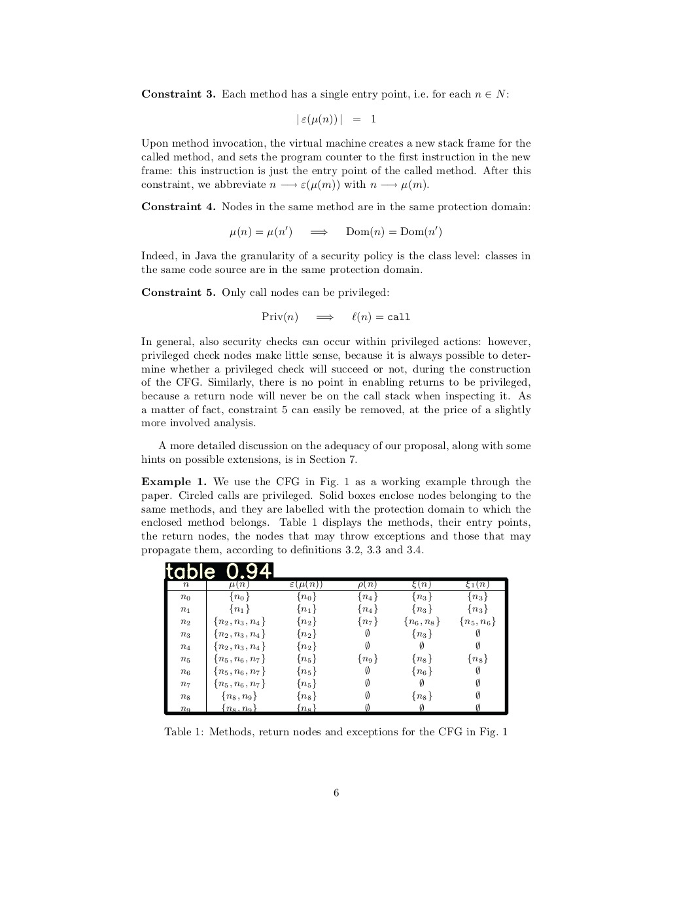
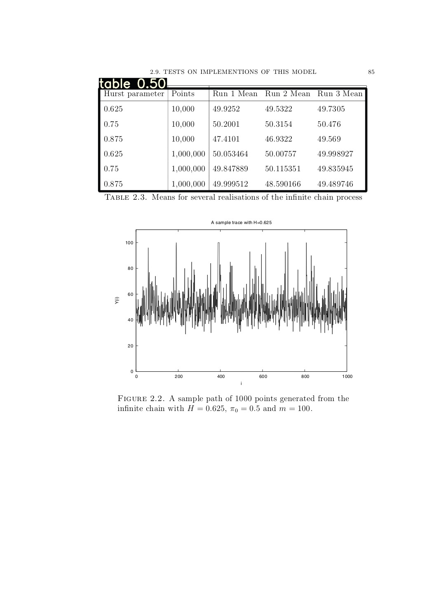
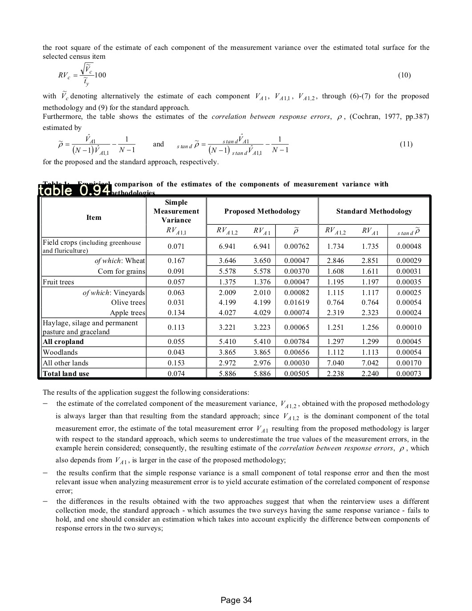

该项目是由 “MT-YOLOv5: Mobile Terminal Table Detection Model based on YOLOv5”论文的代码实现
我们首先展示项目的概要和示例图像，将在论文录用后公布全部的代码

####Requirements
Python 3.8 or later with all [requirements.txt](https://www.runoob.com) dependencies installed, including torch>=1.7. To install run:

First, create environ from scratch with anaconda

 ```python
 # create conda env
conda create --name simp python=3.8
conda activate simp
# install pytorch
conda install pytorch torchvision cudatoolkit=10.2 -c pytorch

# start visdom
nohup python -m visdom.server &

pip install -r requirements.txt
 ```
 visdom 是可视化工具

 
 ####Dataset

 [ ICDAR 2019 cTDaR](https://github.com/cndplab-founder/ICDAR2019_cTDaR)
 我们采用Track A 数据集，训练数据1200张，测试数据439张
 
 
 ####Demo
 
 模型F1值曲线如下图
 
 
 模型采用pytorch -> torchscript方式打包至移动端。
 模型移动端推理测试图像如下：
 
 模型PC端推理测试图像如下：







 